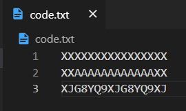

# Introduction

**From the iTunes codes**, this python script produces images which **can be read with iTunes App through the camera.**

```bash
python genItunesImage.py code.txt
```

## Usage

1. input your itunes codes into a text file



2. trigger `genItunesImage.py` with the text file name

```bash
python genItunesImage.py code.txt
```

3. then pruduced images in `img/` directory


## option

- `--size/-s/--order SIZE`: change the size of images (default: 5)
- `--isRawText/-r`: flag for whether input is raw text not file name

If you use with pipe `|`, the flag of `--isRawText/-r` automatically judged true.